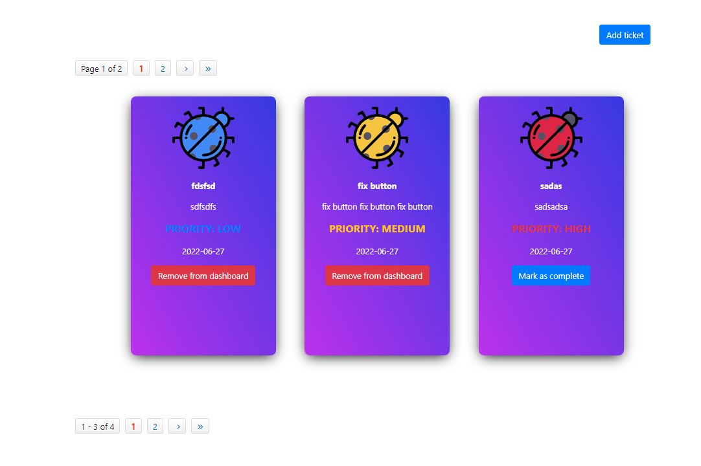

# todo-application

Todo Application with Magnolia DX edition (known as enterprise before v6)

### With magnolia

Install tomcat 9.x  
https://docs.magnolia-cms.com/product-docs/6.2/Developing/Development-environment/Apache-Tomcat.html

In IntelliJ, go to **edit configuration**, on the left side add **Tomcat Server - Local**.

#### Tab Deployment

Press [+] and add Artifact...  **todo-webapp:war exploded**.
Change Application content to **/magnoliaAuthor**

#### Tab Server

URL: **http://localhost:8080/magnoliaLocal/**  
VM options: **-Xmx2048M**

#### Initial data

Copy from `Import_magnolia` all xml files to `todo-core/src/main/resources/mgnl-bootstrap-samples/todo-core`, files in this directory will be loaded on first initialization (empty workspace) of magnolia.  

The following workspace are used that the site works
- **ticket....**, import ALL ticket yaml`s to ticket workspace in JCR in order to have some contents(todo-tickets)
- **website**, magnolia website

If you want to have newer/more data, you can use the **JCR Tools** on prod servers and export it and copy it `mgnl-bootstrap-samples/todo-core`.

Usergroups and userroles are `todo-core/src/main/resources/mgnl-bootstrap/todo-core` folder, so they dont need to be installed. User you can define your own for testing, default is superuser.

The `mgnl-bootstrap-samples/todo-core` is in the gitignore, so you can leave the files. On every `mvn clean install` the data gets wiped. 
The repository is per default configured in the **target/aek-webapp-1.0-SNAPSHOT**, so you can also delete the target folder by yourself.
If you cant to persist the data, you can change the `magnolia.repositories.home=${magnolia.home}/repositories` in the  `todo-webapp/src/main/webapp/WEB-INF/config/your-host-name/magnolia.properties` file.
See sasho folder for example

#### Start server

If you using intellij, you can add under `View / Tool Windows / Services` the Service Tab at the bottom or start with the run on the top.

Right click on Tomcat and **run**.

The website is on http://localhost:8080/magnoliaAuthor/.magnolia/admincentral

First time installation (or any fresh installation), you need to enter the license key, you find the enterprise license in the panter bitwarden (**aek/AEK Bank/Magnolia Enterprise License**).
For new maven install

